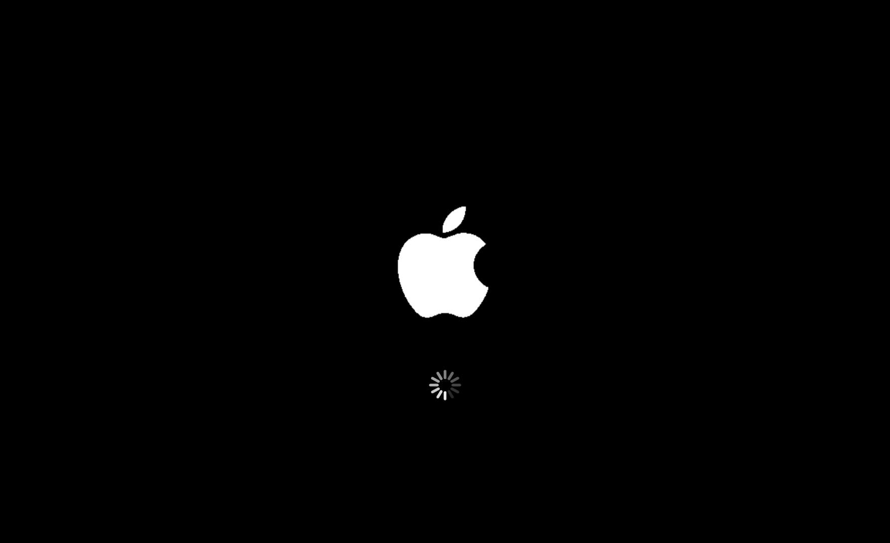

# 🍎 macOS Splash Screen - KDE Plasma

A simple macOS-inspired Splash Screen theme for KDE Plasma.

This theme brings the clean and minimal macOS startup experience to KDE Plasma. It has been created and tested on Fedora KDE Plasma, but it should work on any Linux distribution running KDE Plasma.

## Preview



---

## Installation

Clone the repository:

```bash
git clone https://github.com/mohamedmohsenofficial/macOS-Splash-Screen-KDE-Plasma.git
```

Enter the theme directory:

```bash
cd macOS-Splash-Screen-KDE-Plasma/macOS-Splash-Screen-KDE-Plasma
```

Make the installer executable:

```bash
chmod +x install.sh
```

Run the installer:

```bash
./install.sh
```

Open:

**System Settings → Appearance & Style → Splash Screen**

Select **macOS-Splash-Screen-KDE-Plasma** and click **Apply**.

---

## Manual Installation

```bash
mkdir -p ~/.local/share/plasma/look-and-feel

cp -r macOS-Splash-Screen-KDE-Plasma ~/.local/share/plasma/look-and-feel/
```

Then open:

**System Settings → Appearance & Style → Splash Screen**

Choose **macOS-Splash-Screen-KDE-Plasma** and click **Apply**.

---

## Uninstall

```bash
rm -rf ~/.local/share/plasma/look-and-feel/macOS-Splash-Screen-KDE-Plasma
```

---

## Tested On

- ✅ Fedora KDE Plasma 42-43-44

---

## License

MIT License
